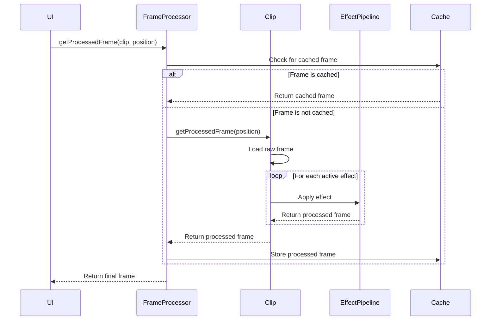

# Effect Pipeline

FlipEdit's effect pipeline is a powerful system that processes video and audio frames through a sequence of effects. This document explains how the pipeline works and how it integrates with the decorator pattern.

## Overview of the Pipeline

The effect pipeline processes each frame of a clip by applying a sequence of effects in order:


Key characteristics of the pipeline:

- **Non-destructive** - The original frame is never modified
- **Sequential** - Effects are applied in a specific order
- **On-demand** - Processing happens only when a frame is requested
- **Composable** - Effects can be added, removed, or reordered at any time

## Pipeline Components

### Effect Pipeline

The `EffectPipeline` class manages the sequence of effects:

```dart
class EffectPipeline {
  final List<IEffect> effects;
  
  Map<String, dynamic> processFrame(Map<String, dynamic> frameData, int framePosition) {
    Map<String, dynamic> processedData = Map<String, dynamic>.from(frameData);
    
    // Apply each active effect in sequence
    for (final effect in effects) {
      if (isEffectActiveAtFrame(effect, framePosition)) {
        processedData = effect.process(processedData);
      }
    }
    
    return processedData;
  }
  
  // Other methods...
}
```

### Frame Processor

The `FrameProcessor` handles frame retrieval and caching:

```dart
class FrameProcessor {
  // Frame cache
  final Map<String, Map<int, Map<String, dynamic>>> _frameCache = {};
  
  Future<Map<String, dynamic>> getProcessedFrame(IClip clip, int framePosition) async {
    // Check cache first
    if (_isFrameCached(clip.id, framePosition)) {
      return _getCachedFrame(clip.id, framePosition);
    }
    
    // Process the frame
    final processedFrame = await clip.getProcessedFrame(framePosition);
    
    // Store in cache
    _cacheFrame(clip.id, framePosition, processedFrame);
    
    return processedFrame;
  }
  
  // Other methods...
}
```

## Effect Processing Flow

When a frame is requested, it goes through the following steps:

1. **Frame Request** - The UI requests a frame at a specific position
2. **Cache Check** - The system checks if the frame is already cached
3. **Source Frame Loading** - If not cached, the raw frame is loaded from the source file
4. **Effect Application** - Each active effect is applied in sequence
5. **Caching** - The processed frame is cached for future use
6. **Rendering** - The processed frame is displayed to the user



## Integration with the Decorator Pattern

The effect pipeline works seamlessly with the decorator pattern:

1. Each effect in the pipeline is an instance of `IEffect`
2. Decorated effects (like `FilterEffectDecorator`) maintain the same interface
3. The pipeline doesn't need to know if an effect is a base effect or a decorator

For example, a filter effect that's actually multiple effects composed together:

```dart
// Create a base effect
BaseEffect baseEffect = EffectFactory.createBaseEffect(...);

// Decorate with a color filter
IEffect colorFilter = FilterEffectDecorator(
  decoratedEffect: baseEffect,
  colorAdjustments: {'brightness': 0.1}
);

// Further decorate with a blur
IEffect blurredColorFilter = BlurEffectDecorator(
  decoratedEffect: colorFilter,
  blurRadius: 5.0
);

// Add to pipeline - pipeline sees this as a single effect
effectPipeline.addEffect(blurredColorFilter);
```

## Effect Timing and Keyframes

Effects in FlipEdit can be timed to apply at specific frames:

```dart
// Effect that starts at frame 30 and lasts for 60 frames
IEffect fadeEffect = FadeEffectDecorator(
  decoratedEffect: baseEffect,
  startFrame: 30,
  durationFrames: 60
);
```

The pipeline checks if an effect is active for the current frame:

```dart
bool isEffectActiveAtFrame(IEffect effect, int framePosition) {
  return effect.startFrame <= framePosition && 
         effect.startFrame + effect.durationFrames > framePosition;
}
```

## Optimizations

The effect pipeline includes several optimizations:

### Frame Caching

Processed frames are cached to avoid redundant processing:

```dart
// Cache lookup
if (_isFrameCached(clip.id, framePosition)) {
  return _getCachedFrame(clip.id, framePosition);
}

// Cache storage
_cacheFrame(clip.id, framePosition, processedFrame);
```

### Preloading

The pipeline can preload frames for smoother playback:

```dart
// Preload next few frames for smoother playback
Future<void> preloadFrames(IClip clip, int startFrame, int endFrame) async {
  for (int i = startFrame; i <= endFrame; i++) {
    if (!_isFrameCached(clip.id, i)) {
      final processedFrame = await clip.getProcessedFrame(i);
      _cacheFrame(clip.id, i, processedFrame);
    }
  }
}
```

### Intelligent Cache Management

The cache automatically manages its size:

```dart
void _pruneCache(String clipId) {
  final clipCache = _frameCache[clipId]!;
  
  if (clipCache.length > maxCacheSize) {
    // Sort frames by position
    final framePositions = clipCache.keys.toList()..sort();
    
    // Remove oldest frames
    final framesToRemove = framePositions.length - maxCacheSize;
    for (int i = 0; i < framesToRemove; i++) {
      clipCache.remove(framePositions[i]);
    }
  }
}
```

## ComfyUI Integration

FlipEdit's effect pipeline integrates with ComfyUI for AI-powered effects:

```dart
class ComfyUIEffect extends EffectDecorator {
  final String workflowId;
  final Map<String, dynamic> parameters;
  
  @override
  Map<String, dynamic> applyDecoration(Map<String, dynamic> frameData) async {
    // Apply the decorated effect first
    Map<String, dynamic> processedData = decoratedEffect.process(frameData);
    
    // Send to ComfyUI for processing
    return await comfyUIService.processFrame(
      workflowId, 
      processedData,
      parameters
    );
  }
}
```

## Custom Effects

Developers can create custom effects by implementing the `IEffect` interface or extending `EffectDecorator`:

```dart
class MyCustomEffect extends EffectDecorator {
  MyCustomEffect({required IEffect decoratedEffect}) : super(decoratedEffect);
  
  @override
  Map<String, dynamic> applyDecoration(Map<String, dynamic> frameData) {
    // Custom processing logic
    // ...
    return result;
  }
}
```

## Next Steps

- [Creating Custom Effects](../extensions/custom-effects.mdx) - Learn to build your own effects
- [ComfyUI Integration](../comfyui/integration.mdx) - Details on using ComfyUI with FlipEdit
- [Performance Optimization](../development/performance.mdx) - Tips for optimizing effect performance
