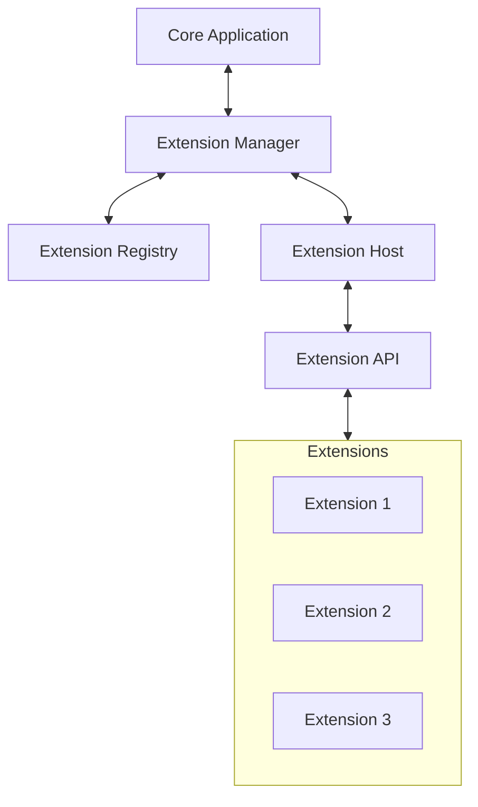
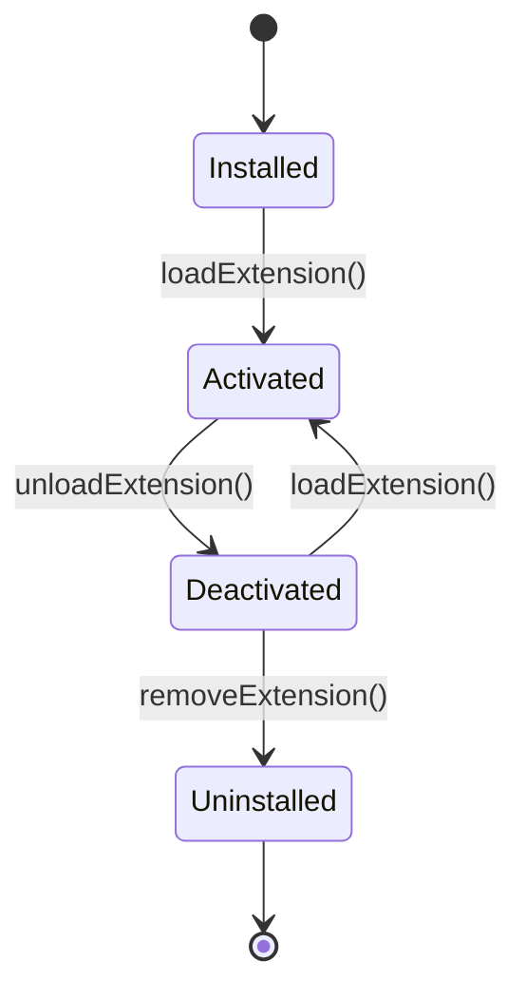

# Extension System

FlipEdit's extension system allows third-party developers to add new functionality to the application. This document explains the architecture of the extension system and how it integrates with the core application.

## Extension System Overview

The extension system in FlipEdit is designed with these goals in mind:

- **Modularity** - Extensions are self-contained units of functionality
- **Safety** - Extensions run in a controlled environment
- **Flexibility** - Extensions can add various types of functionality
- **Integration** - Extensions work seamlessly with the core application
- **Discoverability** - Users can easily find and install extensions



## Key Components

### Extension Framework

The extension framework consists of several key components:

#### Extension Manager

The `ExtensionManager` is responsible for:
- Loading and unloading extensions
- Managing extension lifecycle
- Providing access to extension functionality

```dart
class ExtensionManager {
  final List<Extension> _loadedExtensions = [];
  final ExtensionRegistry _registry;
  
  Future<void> loadExtension(String extensionId) async {
    // Load extension from registry
    final extension = await _registry.getExtension(extensionId);
    
    // Initialize extension
    await _extensionHost.initialize(extension);
    
    // Register extension components
    _registerExtensionComponents(extension);
    
    // Add to loaded extensions
    _loadedExtensions.add(extension);
  }
  
  // Other methods...
}
```

#### Extension Host

The `ExtensionHost` provides a runtime environment for extensions:

```dart
class ExtensionHost {
  Future<void> initialize(Extension extension) async {
    // Create isolated environment for extension
    final isolate = await Isolate.spawn(
      _runExtension,
      ExtensionInitData(
        extension: extension,
        apiPort: _receivePort.sendPort,
      ),
    );
    
    // Store reference to isolate
    _extensionIsolates[extension.id] = isolate;
  }
  
  // Other methods...
}
```

#### Extension Context

The `ExtensionContext` provides extensions with access to the API:

```dart
class ExtensionContext {
  final String extensionId;
  final CommandsAPI commands;
  final ServicesAPI services;
  final StateAPI state;
  final EventsAPI events;
  
  // Methods available to extensions
  void registerCommand(String commandId, CommandHandler handler) {
    commands.register(extensionId, commandId, handler);
  }
  
  // Other methods...
}
```

### Extension API

The Extension API provides interfaces for extensions to interact with the core application:

#### Commands API

Allows extensions to register and execute commands:

```dart
class CommandsAPI {
  Future<void> register(
    String extensionId, 
    String commandId, 
    CommandHandler handler
  ) async {
    // Register command with the command registry
  }
  
  Future<dynamic> execute(String commandId, [Map<String, dynamic>? args]) async {
    // Execute a command
  }
}
```

#### Services API

Provides access to core services:

```dart
class ServicesAPI {
  Future<dynamic> getService(String serviceId) async {
    // Return proxy to requested service
  }
}
```

#### State API

Allows extensions to store and retrieve state:

```dart
class StateAPI {
  Future<void> set(String key, dynamic value) async {
    // Store state value
  }
  
  Future<dynamic> get(String key) async {
    // Retrieve state value
  }
}
```

#### Events API

Enables pub/sub communication:

```dart
class EventsAPI {
  Future<void> emit(String eventName, [dynamic data]) async {
    // Emit event
  }
  
  Future<Subscription> on(String eventName, EventHandler handler) async {
    // Subscribe to event
  }
}
```

## Extension Manifests

Each extension must include a manifest file that describes its capabilities:

```json
{
  "id": "com.example.my-extension",
  "name": "My Extension",
  "version": "1.0.0",
  "description": "A sample extension for FlipEdit",
  "author": "Example Developer",
  "main": "main.dart",
  "contributes": {
    "commands": [
      {
        "id": "myExtension.doSomething",
        "title": "Do Something"
      }
    ],
    "effects": [
      {
        "id": "myExtension.coolEffect",
        "name": "Cool Effect",
        "type": "filter"
      }
    ],
    "views": [
      {
        "id": "myExtension.settingsView",
        "name": "My Extension Settings",
        "location": "sidebar"
      }
    ]
  },
  "dependencies": {
    "other-extension": "^1.0.0"
  }
}
```

## Extension Structure

A typical extension follows this structure:

```
my-extension/
├── manifest.json           # Extension metadata
├── main.dart               # Entry point
├── models/                 # Extension-specific models
│   └── my_effect_settings.dart
├── services/               # Extension-specific services
│   └── my_service.dart
├── views/                  # UI components
│   ├── settings_panel.dart
│   └── effect_controls.dart
└── workflows/              # ComfyUI workflows
    └── my_workflow.json
```

## Registration Process

When an extension is loaded, it goes through these registration steps:

1. **Manifest Validation** - Verify the manifest format and requirements
2. **Dependency Resolution** - Load any dependencies
3. **Extension Initialization** - Call the extension's activate method
4. **Component Registration** - Register commands, effects, views, etc.
5. **UI Integration** - Add UI elements to the appropriate locations

## Extension Lifecycle

Extensions follow this lifecycle:



Each state has associated events:

- **Installed** - Extension is downloaded and ready
- **Activated** - Extension is running and integrated
- **Deactivated** - Extension is temporarily disabled
- **Uninstalled** - Extension is completely removed

## Extension Types

FlipEdit supports several types of extensions:

### Effect Extensions

Add new video or audio effects:

```dart
class MyCustomEffect extends EffectDecorator {
  final double intensity;
  
  MyCustomEffect({
    required IEffect decoratedEffect,
    this.intensity = 1.0,
  }) : super(decoratedEffect);
  
  @override
  Map<String, dynamic> applyDecoration(Map<String, dynamic> frameData) {
    // Apply custom effect
    // Implementation details...
    return result;
  }
}
```

### UI Extensions

Add new UI components:

```dart
class MyEffectPanel extends StatelessWidget {
  @override
  Widget build(BuildContext context) {
    return Container(
      child: Column(
        children: [
          Text('My Custom Effect'),
          Slider(
            value: _intensity,
            onChanged: (value) {
              // Update effect settings
            },
          ),
        ],
      ),
    );
  }
}
```

### Workflow Extensions

Add new ComfyUI workflows:

```dart
class MyWorkflowExtension {
  void activate(ExtensionContext context) {
    context.registerWorkflow(
      id: 'myExtension.coolWorkflow',
      name: 'Cool Workflow',
      workflowPath: 'workflows/my_workflow.json',
    );
  }
}
```

## Security and Isolation

FlipEdit uses several techniques to ensure extensions are secure:

- **Isolates** - Extensions run in separate Dart isolates
- **Permission System** - Extensions must request specific permissions
- **API Boundaries** - Extensions can only access approved APIs
- **Resource Limiting** - Extensions have limited memory and CPU usage

## Creating an Extension

Here's a simple example of an extension's main entry point:

```dart
import 'package:flipedit/extensions/api/extension_context.dart';

void activate(ExtensionContext context) {
  // Register a command
  context.registerCommand(
    'myExtension.sayHello',
    (args) {
      context.showNotification('Hello from My Extension!');
      return null;
    },
  );
  
  // Register an effect
  context.registerEffect(
    'myExtension.coolEffect',
    (args) => MyCustomEffect(
      decoratedEffect: args['effect'],
      intensity: args['intensity'] ?? 1.0,
    ),
  );
  
  // Register a view
  context.registerView(
    'myExtension.settingsView',
    (args) => MySettingsPanel(),
  );
  
  // Listen for events
  context.events.on('clip.selected', (data) {
    // React to clip selection
  });
}

void deactivate(ExtensionContext context) {
  // Clean up resources
}
```

## Next Steps

- [Creating Extensions](../extensions/creating.mdx) - Step-by-step guide to creating extensions
- [Extension API Reference](../api-reference/extension-api.mdx) - Complete API documentation
- [Extension Examples](../extensions/examples.mdx) - Example extensions to learn from
