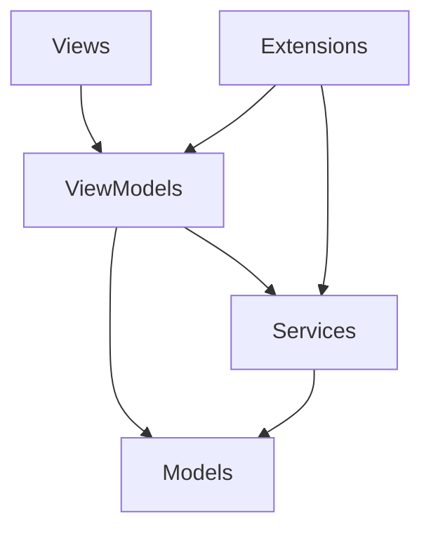
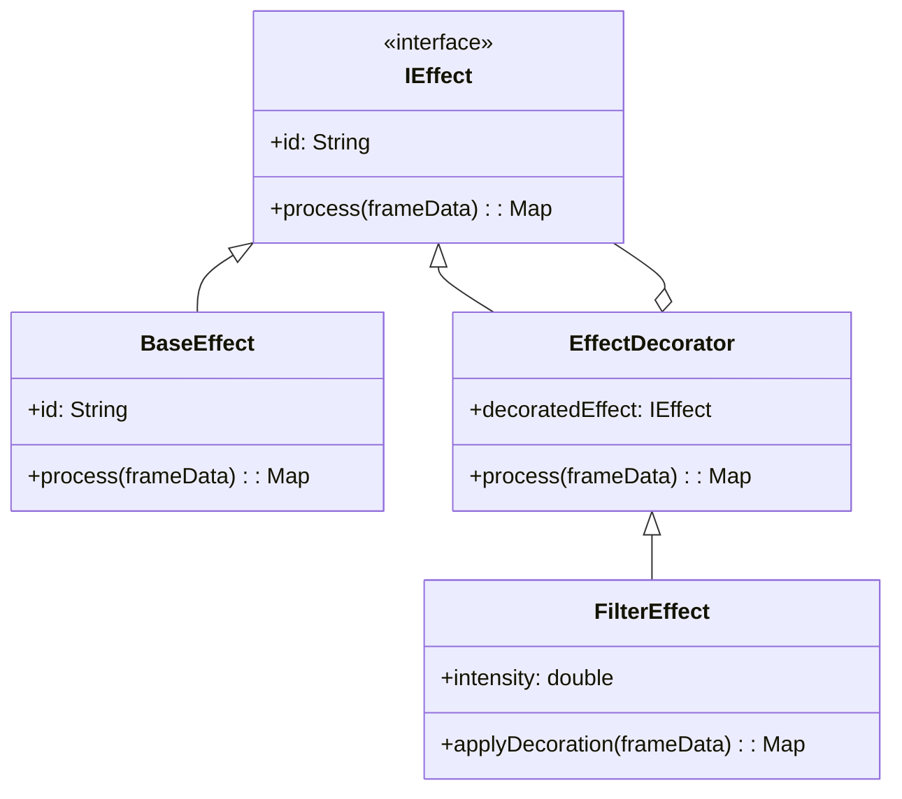
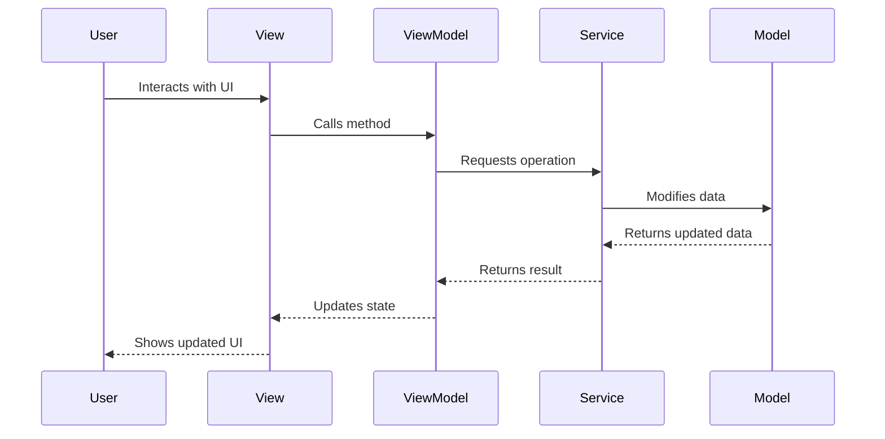

# FlipEdit Architecture Overview

FlipEdit is built with a modern, extensible architecture designed for high performance and flexibility. This guide explains the core architectural principles and how the different components work together.

## Core Architecture Principles

FlipEdit follows the **Model-View-ViewModel (MVVM)** architectural pattern combined with a **Decorator Pattern** for effect handling. This architecture was chosen to provide:

- Clear separation of concerns
- Reactive UI updates
- Non-destructive video editing
- Extensibility via plugins

## Architectural Layers

The application is divided into several distinct layers:



### Models Layer

The models layer represents the core domain entities and business logic:

- Data structures (clips, effects, projects)
- Domain-specific rules
- Serialization logic

Models in FlipEdit use interfaces and implementations to support the decorator pattern, which is essential for non-destructive video editing.

### ViewModels Layer

ViewModels serve as the intermediary between views and models:

- Expose data for the UI
- Handle user interactions
- Convert model data into view-friendly formats
- Coordinate with services for complex operations

All ViewModels in FlipEdit implement `ChangeNotifier` and are integrated with the `watch_it` state management system.

### Views Layer

The views layer contains all the UI components:

- Screen layouts
- Widgets for user interaction
- Visual representation of data
- No business logic, only UI logic

Views observe ViewModels using the `watchPropertyValue` pattern to automatically update when data changes.

### Services Layer

Services provide essential functionality across the application:

- File operations
- Media processing
- ComfyUI integration
- Persistence

Services are registered using dependency injection with `get_it` and accessed by ViewModels as needed.

## Key Design Patterns

### Decorator Pattern

FlipEdit makes extensive use of the decorator pattern for effects:



This pattern enables:

- Non-destructive editing
- Effect composition
- Easy extension with new effect types

### Factory Pattern

Factories simplify the creation of complex objects:

- `ClipFactory` - Creates and composes clips
- `EffectFactory` - Creates and wraps effects

### Dependency Injection

FlipEdit uses the `get_it` service locator pattern for dependency injection:

- Services are registered at app startup
- ViewModels access services through the service locator
- Testing is simplified with mockable dependencies

## State Management

State management in FlipEdit is handled using the `watch_it` library, which builds on `get_it`:

- ViewModels are registered as singletons
- UI components watch ViewModel properties
- The UI automatically updates when ViewModel properties change

```dart
class MyWidget extends StatelessWidget with WatchItMixin {
  @override
  Widget build(BuildContext context) {
    final project = watchPropertyValue((ProjectViewModel vm) => vm.currentProject);
    
    // UI automatically updates when currentProject changes
    return Text(project.name);
  }
}
```

## Extension System

FlipEdit provides an extension system that allows third-party developers to enhance the application:

- Extensions can add new effects
- Extensions can provide custom UI
- Extensions integrate with ComfyUI workflows

The extension system uses a combination of the adapter pattern and dependency injection to maintain clean boundaries between core functionality and extensions.

## Data Flow



This unidirectional data flow ensures predictable state changes and simplifies debugging.

## Next Steps

- [MVVM Architecture](./mvvm.mdx) - Dive deeper into our MVVM implementation
- [Decorator Pattern](./decorator-pattern.mdx) - Learn how we use decorators for effects
- [Effect Pipeline](./effect-pipeline.mdx) - Understand the effect processing pipeline
- [Extension System](./extension-system.mdx) - Understanding the extension architecture
- [Extension Development](../extensions/creating.mdx) - Build your own extensions
