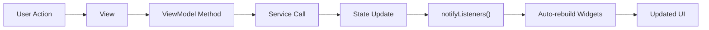

# State Management

FlipEdit uses a combination of `get_it` and `watch_it` for dependency injection and reactive state management. This approach enables a clean separation of concerns while providing an efficient way to update the UI when state changes.

## Service Locator Pattern with get_it

The service locator pattern is implemented in FlipEdit using the `get_it` package. This pattern centralizes the registration and resolution of dependencies, making it easy to access services and ViewModels from anywhere in the app.

### Setting Up the Service Locator

```dart
import 'package:flipedit/viewmodels/app_viewmodel.dart';
import 'package:flipedit/services/uv_manager.dart';
import 'package:watch_it/watch_it.dart';

// Use the global di instance provided by watch_it
void setupServiceLocator() {
  // Services
  di.registerLazySingleton<UvManager>(() => UvManager());
  di.registerLazySingleton<ComfyUIService>(() => ComfyUIService());

  // ViewModels
  di.registerLazySingleton<AppViewModel>(() => AppViewModel());
  di.registerLazySingleton<ProjectViewModel>(() => ProjectViewModel());
  di.registerLazySingleton<EditorViewModel>(() => EditorViewModel());
}
```

### Accessing Dependencies

Once registered, dependencies can be accessed from anywhere in the app using the global `di` instance:

```dart
// In a ViewModel
final UvManager _uvManager = di<UvManager>();

// In a widget
final projectName = di<ProjectViewModel>().currentProject?.name;
```

## Reactive UI with watch_it

The `watch_it` package extends `get_it` with reactive features that allow widgets to observe specific properties of ViewModels and automatically rebuild when those properties change.

### ViewModels as ChangeNotifiers

ViewModels in FlipEdit extend `ChangeNotifier` to provide change notification:

```dart
class AppViewModel extends ChangeNotifier {
  bool _isInitialized = false;
  bool get isInitialized => _isInitialized;
  
  void updateStatusMessage(String message) {
    _statusMessage = message;
    notifyListeners(); // Notify observers of change
  }
}
```

### Observing ViewModels with WatchItMixin

Widgets use the `WatchItMixin` to observe specific properties of ViewModels:

```dart
class ProjectTitle extends StatelessWidget with WatchItMixin {
  @override
  Widget build(BuildContext context) {
    // Watch a specific property
    final projectName = watchPropertyValue(
      (ProjectViewModel vm) => vm.currentProject?.name
    ) ?? 'Untitled Project';
    
    return Text(projectName);
  }
}
```

The `watchPropertyValue` method:
1. Accesses the ViewModel from the service locator
2. Registers the widget as an observer for the specific property
3. Returns the current value of the property
4. Automatically rebuilds the widget when the property changes

## Advantages of this Approach

### 1. Fine-grained Reactivity

Widgets only rebuild when the specific properties they observe change, not when any part of the ViewModel changes.

```dart
// Only rebuilds when selectedClipName changes
final clipName = watchPropertyValue(
  (TimelineViewModel vm) => vm.selectedClipName
);

// Only rebuilds when isPlaying changes
final isPlaying = watchPropertyValue(
  (PlayerViewModel vm) => vm.isPlaying
);
```

### 2. Multiple Observable Sources

A single widget can observe properties from multiple ViewModels without complex nesting:

```dart
Widget build(BuildContext context) {
  final projectName = watchPropertyValue(
    (ProjectViewModel vm) => vm.currentProject?.name
  );
  
  final isPlaying = watchPropertyValue(
    (PlayerViewModel vm) => vm.isPlaying
  );
  
  final selectedEffect = watchPropertyValue(
    (EffectsViewModel vm) => vm.selectedEffect
  );
  
  // UI that responds to changes in all three properties
  return Column(
    children: [
      Text(projectName ?? 'No project'),
      Icon(isPlaying ? Icons.pause : Icons.play),
      if (selectedEffect != null) EffectEditor(effect: selectedEffect),
    ],
  );
}
```

### 3. Easy to Test

ViewModels can be tested independently of the UI:

```dart
test('ProjectViewModel creates new project', () {
  final viewModel = ProjectViewModel();
  viewModel.createProject('Test Project');
  
  expect(viewModel.currentProject?.name, equals('Test Project'));
});
```

### 4. Clean Separation of Concerns

- **Views** focus solely on UI layout and presentation
- **ViewModels** manage state and business logic
- **Services** handle external operations and data processing

## Unidirectional Data Flow

FlipEdit follows a unidirectional data flow pattern:



1. User interacts with the UI
2. UI triggers a method on a ViewModel
3. ViewModel may call a service to perform an operation
4. ViewModel updates its state
5. ViewModel calls `notifyListeners()`
6. Widgets observing the state automatically rebuild
7. User sees updated UI

## Best Practices

### 1. Keep ViewModels Focused

Each ViewModel should focus on a specific aspect of the application:

- `ProjectViewModel` - Project management
- `EditorViewModel` - Editor layout
- `TimelineViewModel` - Timeline operations
- `EffectsViewModel` - Effect management

### 2. Use Computed Properties

ViewModels can provide computed properties to transform raw data into UI-friendly formats:

```dart
class TimelineViewModel extends ChangeNotifier {
  // Raw data
  List<Clip> _clips = [];
  
  // Computed property
  List<Clip> get visibleClips => 
    _clips.where((clip) => clip.visible).toList();
    
  // Another computed property
  Duration get totalDuration {
    if (_clips.isEmpty) return Duration.zero;
    
    final lastClip = _clips.reduce((a, b) => 
      a.endTime > b.endTime ? a : b);
    return lastClip.endTime;
  }
}
```

### 3. Minimize State in Widgets

Keep state in ViewModels, not in widgets:

```dart
// Bad: State in widget
class BadExample extends StatefulWidget {
  @override
  _BadExampleState createState() => _BadExampleState();
}

class _BadExampleState extends State<BadExample> {
  bool _isPlaying = false;
  
  void _togglePlay() {
    setState(() {
      _isPlaying = !_isPlaying;
    });
  }
}

// Good: State in ViewModel
class GoodExample extends StatelessWidget with WatchItMixin {
  @override
  Widget build(BuildContext context) {
    final isPlaying = watchPropertyValue(
      (PlayerViewModel vm) => vm.isPlaying
    );
    
    return IconButton(
      icon: Icon(isPlaying ? Icons.pause : Icons.play),
      onPressed: () => di<PlayerViewModel>().togglePlayPause(),
    );
  }
}
```

### 4. Handle Side Effects in ViewModels

ViewModels should handle side effects such as loading data or saving changes:

```dart
class ProjectViewModel extends ChangeNotifier {
  // Side effect method
  Future<void> saveProject() async {
    _isSaving = true;
    notifyListeners();
    
    try {
      await _projectService.saveProject(_currentProject!);
      _lastSavedAt = DateTime.now();
    } catch (e) {
      _errorMessage = 'Failed to save: $e';
    } finally {
      _isSaving = false;
      notifyListeners();
    }
  }
}
```

## Comparison with Other State Management Solutions

### Compared to Provider

Provider offers a similar pattern with `ChangeNotifier` and `Consumer`, but watch_it provides more fine-grained control:

```dart
// Provider approach
Consumer<ProjectViewModel>(
  builder: (context, viewModel, child) {
    // Rebuilds when ANY property in ProjectViewModel changes
    return Text(viewModel.currentProject?.name ?? 'Untitled');
  },
);

// watch_it approach
watchPropertyValue((ProjectViewModel vm) => vm.currentProject?.name);
// Only rebuilds when currentProject?.name changes
```

### Compared to Bloc/Cubit

Bloc and Cubit provide more structured state management but require more boilerplate:

```dart
// Bloc approach (simplified)
BlocBuilder<ProjectBloc, ProjectState>(
  builder: (context, state) {
    return Text(state.project?.name ?? 'Untitled');
  },
);

// watch_it approach
watchPropertyValue((ProjectViewModel vm) => vm.currentProject?.name);
```

## Next Steps

- [Working with ViewModels](../development/viewmodels.mdx)
- [Testing State Management](../development/testing.mdx)
- [Creating New Features](../development/new-features.mdx)
