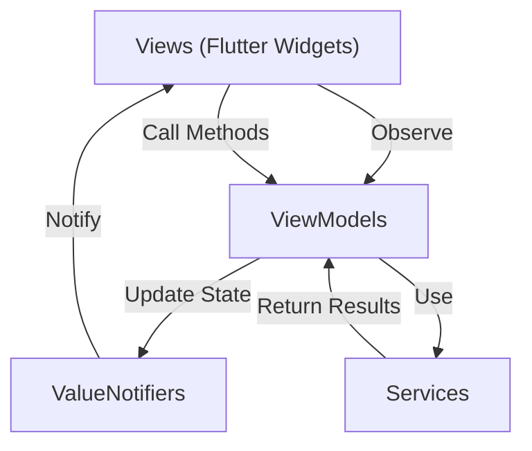

# State Management

FlipEdit uses a structured approach to state management based on the MVVM pattern combined with reactive components. This document provides a high-level overview of how state is managed in the application.

## Core State Management Principles

FlipEdit's state management follows these key principles:

1. **Single Source of Truth** - State is stored in ViewModels
2. **Unidirectional Data Flow** - Data flows in a predictable direction
3. **Reactive Updates** - UI automatically updates when state changes
4. **Dependency Injection** - Services and ViewModels are accessed through a service locator

## State Management Architecture



### ViewModels as State Containers

In FlipEdit, ViewModels serve as the primary state containers:

- Each ViewModel manages a specific slice of application state
- ViewModels expose state through `ValueNotifier` objects
- UI components observe these `ValueNotifier` objects for changes

### Unidirectional Data Flow

When a user interacts with the UI, the following sequence occurs:

1. User interacts with a View
2. View calls a method on a ViewModel
3. ViewModel updates its internal `ValueNotifier` properties
4. `ValueNotifier` notifies observers of the change
5. Views observing that `ValueNotifier` automatically update

This unidirectional flow ensures predictable state changes and simplifies debugging.

## Types of State in FlipEdit

FlipEdit manages several types of state:

### 1. Application State

- Current project
- User preferences
- Application settings
- Authorization status

### 2. UI State

- Selected items
- Panel configurations
- Timeline position
- Playback state

### 3. Ephemeral State

- Form input values
- Scroll positions
- Transient UI states

## State Management Tools

FlipEdit leverages two key libraries for state management:

1. **watch_it** - A reactive state management library that provides dependency injection and reactive UI updates
2. **ValueNotifier** - Flutter's built-in observable value container

Together, these tools provide:
- Centralized service and ViewModel registration
- Fine-grained reactivity for UI updates
- Clean, declarative state observation in UI components

For detailed implementation information, see [Using watch_it in FlipEdit](../development/get-it-and-watch-it.mdx).

## UI Reactivity

FlipEdit uses `watch_it` to observe `ValueNotifier` properties from ViewModels:

```dart
// Example of property observation
final clips = watchValue((TimelineViewModel vm) => vm.clipsNotifier);
final currentFrame = watchValue((TimelineViewModel vm) => vm.currentFrameNotifier);
final isPlaying = watchValue((TimelineViewModel vm) => vm.isPlayingNotifier);
```

This approach:
- Eliminates nested `ValueListenableBuilder` widgets
- Provides a clean, declarative way to observe multiple properties
- Automatically rebuilds widgets when observed properties change

## ViewModel Structure

ViewModels in FlipEdit follow a consistent pattern:

```dart
class EditorViewModel {
  // State exposed as ValueNotifier objects
  final ValueNotifier<bool> isTimelineVisibleNotifier = ValueNotifier<bool>(true);
  final ValueNotifier<String> selectedClipIdNotifier = ValueNotifier<String>('');
  
  // Getters and setters for convenience
  bool get isTimelineVisible => isTimelineVisibleNotifier.value;
  set isTimelineVisible(bool value) {
    if (isTimelineVisibleNotifier.value == value) return;
    isTimelineVisibleNotifier.value = value;
  }
  
  // Actions that modify state
  void toggleTimeline() {
    isTimelineVisible = !isTimelineVisible;
  }
}
```

## State Management Best Practices

When working with FlipEdit's state management, follow these best practices:

### 1. Keep ViewModels Focused

Each ViewModel should manage a specific domain of state:
- `ProjectViewModel` for project data
- `TimelineViewModel` for timeline state
- `EffectsViewModel` for effects configuration

### 2. Use ValueNotifier Consistently

Follow the naming conventions for `ValueNotifier` properties:
- Name `ValueNotifier` properties with the `Notifier` suffix (e.g., `selectedClipIdNotifier`)
- Provide getter/setter pairs for convenient access
- Check equality in setters to prevent unnecessary updates

### 3. Minimize State in Widgets

Keep state in ViewModels, not in widget state:
- Use `StatelessWidget` with `WatchItMixin` when possible
- Only use `StatefulWidget` for truly local UI state

### 4. Handle Side Effects in ViewModels

Operations like loading data or saving changes should be handled in ViewModels:

```dart
void loadProject(String id) {
  isLoadingNotifier.value = true;
  
  projectService.loadProject(id).then((project) {
    currentProjectNotifier.value = project;
    isLoadingNotifier.value = false;
  }).catchError((error) {
    errorMessageNotifier.value = 'Failed to load project: $error';
    isLoadingNotifier.value = false;
  });
}
```

## Next Steps

- [Using watch_it in FlipEdit](../development/get-it-and-watch-it.mdx) - Detailed implementation guide
- [Working with ViewModels](../development/viewmodels.mdx) - Practical guide to creating ViewModels
- [Testing State Management](../development/testing.mdx) - Testing strategies for state management
