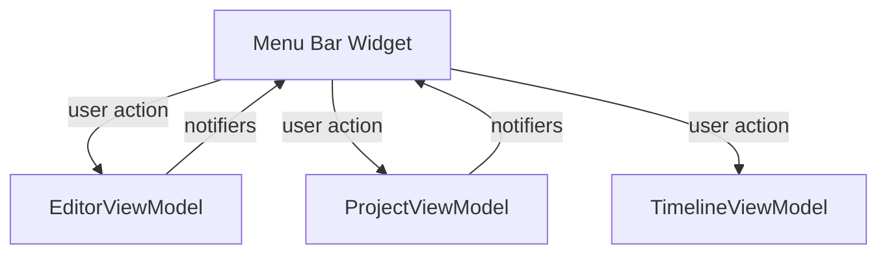

# Application Menu Bar

A unified, platform-adaptive menu bar for FlipEdit that enables essential app-wide actions such as project management, media import, undo/redo, track editing, and UI panel visibility toggles. This menu bar is implemented using two widgets, each tailored to major desktop platforms for a native and consistent experience.

## Table of Contents

- [Overview](#overview)
- [Key Features](#key-features)
- [Platform Differences](#platform-differences)
- [Usage Example](#usage-example)
- [Menu Actions Reference](#menu-actions-reference)
- [MVVM Architecture & Data Flow](#mvvm-architecture--data-flow)
- [Troubleshooting](#troubleshooting)
- [Complete Example](#complete-example)

## Overview

The **App Menu Bar** is the top-level navigation component in FlipEdit, providing quick access to common file, edit, track, and view actions. The menu is context-aware: items are enabled or disabled depending on whether a project is loaded and current application state.

It supports:

- **Project actions:** New/Open Project, Import Media
- **Edit actions:** Undo, Redo
- **Track management:** Add Video/Audio Track
- **Panel/view toggles:** Inspector, Timeline, Preview

## Key Features

- **Platform-aware UI:** Uses native/high-fidelity menus for each supported OS
- **MVVM integration:** Menu actions dispatch to ViewModels with clean, stateless handlers
- **Contextual enable/disable:** Only allows actions when appropriate (e.g., disables Undo/help when project is not loaded)
- **Toggleable visibility:** For Inspector, Timeline, and Preview panels—includes status checkmarks (Fluent UI)

## Platform Differences

There are two main menu implementations based on the OS:

### macOS / Windows

- **Widget:** `PlatformAppMenuBar`
- **Menu style:** Uses `PlatformMenuBar` and `PlatformMenuItem` for native appearance
- **Menu placement:** System/top (native menu bar)
- **No checkmarks displayed for toggle state** (simple action menus)

### Linux / Other

- **Widget:** `FluentAppMenuBar`
- **Menu style:** Uses `DropDownButton` and `MenuFlyoutItem` from Fluent UI
- **Menu placement:** In-app, trailing edge of top bar
- **Checkmarks:** Toggles (Inspector, Timeline, Preview) show Fluent icons to indicate panel visibility

## Usage Example

All menu bar widgets require these three ViewModels and (for PlatformAppMenuBar) a child widget.

```dart
import 'package:flipedit/views/widgets/app_menu_bar.dart';
import 'package:flipedit/viewmodels/editor_viewmodel.dart';
import 'package:flipedit/viewmodels/project_viewmodel.dart';
import 'package:flipedit/viewmodels/timeline_viewmodel.dart';

Widget build(BuildContext context) {
  return PlatformAppMenuBar(
    editorVm: editorViewModel,    // Controls panel visibility
    projectVm: projectViewModel,  // Manages project & asset actions
    timelineVm: timelineViewModel, // Undo/redo timeline actions
    child: Scaffold(
      // ...main app content...
    ),
  );
}

// For Linux/Other:
return FluentAppMenuBar(
  editorVm: editorViewModel,
  projectVm: projectViewModel,
  timelineVm: timelineViewModel,
);
```

## Menu Actions Reference

| Menu    | Action           | Description                                      | Enabled When               |
|---------|------------------|--------------------------------------------------|----------------------------|
| File    | New Project      | Launches dialog to create new FlipEdit project   | Always                     |
|         | Open Project...  | Opens existing FlipEdit project                  | Always                     |
|         | Import Media...  | Imports assets/media into loaded project         | Project loaded             |
| Edit    | Undo             | Reverts last timeline action                     | Project loaded, has undo   |
|         | Redo             | Re-applies last undone action                    | Project loaded, has redo   |
| Track   | Add Video Track  | Adds a new video track to project (via Command)  | Project loaded             |
|         | Add Audio Track  | Adds a new audio track to project (via Command)  | Project loaded             |
| View    | Inspector        | Toggle visibility of Inspector panel             | Always                     |
|         | Timeline         | Toggle visibility of Timeline panel              | Always                     |
|         | Preview          | Toggle visibility of Preview panel               | Always                     |

## MVVM Architecture & Data Flow

- **Menu Bar Widgets (View):** Statelesly trigger all actions, never hold app data
- **ViewModels (MVVM):**
  - `EditorViewModel`: Controls which panels are shown
  - `ProjectViewModel`: Handles loading, opening, media import, and track adding via Commands
  - `TimelineViewModel`: Manages timeline Undo/Redo
- **Reactive State:** Uses `ValueListenableBuilder` to re-render menus based on state (e.g., `isProjectLoadedNotifier`)

### High-level Data Flow Diagram



- **Commands, not business logic**: The menu bar initiates actions, but actual file/undo logic lives in ViewModels/Commands

## Troubleshooting

- **Menu items are disabled:** A project must be loaded for most commands, including media import and track actions.
- **Undo/Redo not working:** Only available if the timeline has actions to undo/redo, and when a project is loaded.
- **Platform menu not visible**: Ensure platform is detected correctly; Linux uses in-app Fluent dropdowns.

## Complete Example Code

Below are simplified, copy-pastable versions for integrating menus in your app.

```dart
/// PlatformAppMenuBar: for macOS/Windows
class PlatformAppMenuBar extends StatefulWidget {
  /// ViewModel to control editor panels like Inspector, Timeline, Preview.
  final EditorViewModel editorVm;

  /// ViewModel for project state and project-wide actions.
  final ProjectViewModel projectVm;

  /// ViewModel for timeline editing and undo/redo.
  final TimelineViewModel timelineVm;

  /// Main content shown below the menu bar.
  final Widget child;

  const PlatformAppMenuBar({
    super.key,
    required this.editorVm,
    required this.projectVm,
    required this.timelineVm,
    required this.child,
  });

  @override
  State<PlatformAppMenuBar> createState() => _PlatformAppMenuBarState();
}

/// FluentAppMenuBar: for Linux/Other
class FluentAppMenuBar extends StatefulWidget {
  final EditorViewModel editorVm;
  final ProjectViewModel projectVm;
  final TimelineViewModel timelineVm;

  const FluentAppMenuBar({
    super.key,
    required this.editorVm,
    required this.projectVm,
    required this.timelineVm,
  });

  @override
  State<FluentAppMenuBar> createState() => _FluentAppMenuBarState();
}
```

## Architectural Notes

- **Widgets have no business logic**—they only call ViewModel/Command APIs.
- **MVVM separation**: All logic for creating/opening project, importing, undo/redo, and toggling views is delegated to ViewModels or Commands.
- **Adaptation via platform separation**: Two widgets used to ensure native UX on all platforms.

---