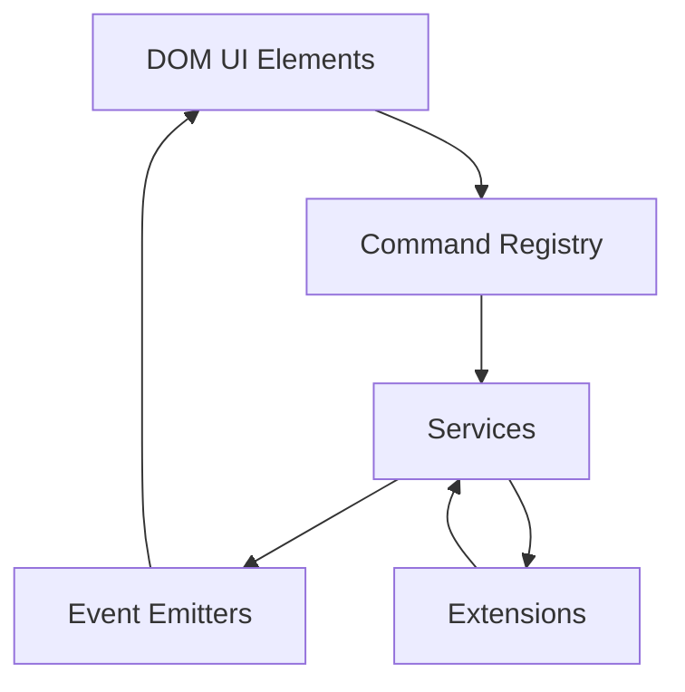
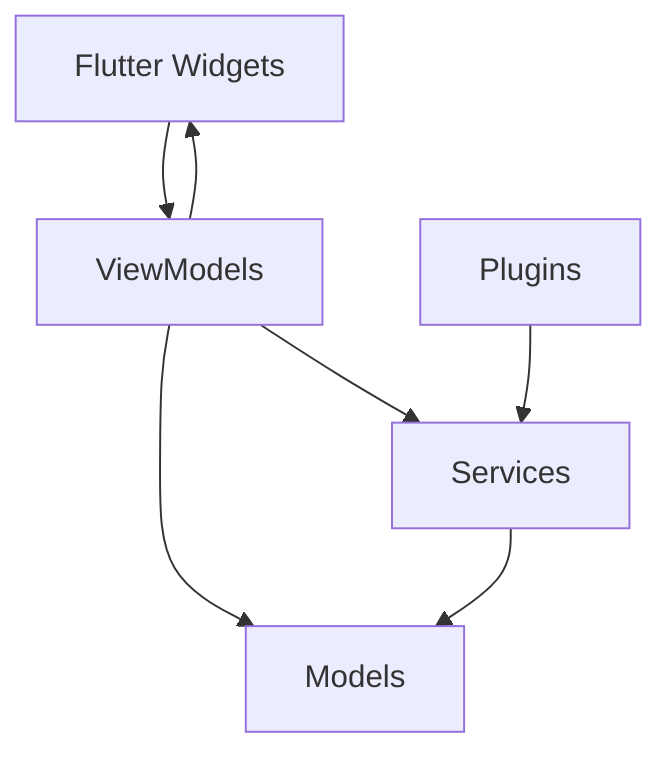

# FlipEdit vs VS Code Architecture

FlipEdit draws inspiration from Visual Studio Code's architecture while adapting it to work with Flutter. This guide compares the architectural approaches of both applications to help you understand the similarities and differences.

## Core Architecture Comparison

| Aspect | VS Code | FlipEdit |
|--------|---------|----------|
| Language | TypeScript | Dart/Flutter |
| Architecture | Service-based | Model-View-ViewModel (MVVM) |
| UI Framework | Custom Web (Electron) | Flutter |
| State Management | Custom service-based system | MVVM with watch_it |
| Extension Model | Extension Host | Plugin System |
| Command System | Command Registry | Action System |

## Components Comparison

### VS Code Components

VS Code organizes its architecture around services and event-based communication:



### FlipEdit Components

FlipEdit uses the MVVM pattern with reactive state management:



## Service/Dependency Management Comparison

### VS Code Service Registration

VS Code uses dependency injection with a custom instantiation service:

```typescript
// VS Code service registration
class InstantiationService {
  constructor(services) {
    this._services = services;
  }

  createInstance(ctor, ...args) {
    // Resolves dependencies using decorators and creates instances
  }
}

// Registration
const instantiationService = new InstantiationService(services);
instantiationService.createInstance(EditorService);
instantiationService.createInstance(WorkspaceService);

// Usage with dependency injection
export class EditorService {
  constructor(
    @IFileService fileService,
    @IConfigurationService configService
  ) {
    // Use the injected services
  }
}
```

### FlipEdit Service Registration

FlipEdit uses the `watch_it` package which provides a global `di` instance:

```dart
// FlipEdit service registration
void setupServiceLocator() {
  // Register services
  di.registerLazySingleton<EditorService>(() => EditorService());
  di.registerLazySingleton<WorkspaceService>(() => WorkspaceService());
  
  // Register ViewModels
  di.registerLazySingleton<EditorViewModel>(() => EditorViewModel());
}

// Usage
class EditorViewModel {
  // Get dependencies via service locator
  final EditorService _editorService = di<EditorService>();
  final WorkspaceService _workspaceService = di<WorkspaceService>();
  
  // ValueNotifier properties
  final ValueNotifier<String> selectedPathNotifier = ValueNotifier<String>('');
}
```

## State Management and Reactivity Comparison

### VS Code State Management

VS Code uses an event-based system for reactivity:

```typescript
// VS Code event model
class EditorService {
  private readonly _onDidChangeActiveEditor = new Emitter<IEditor>();
  readonly onDidChangeActiveEditor = this._onDidChangeActiveEditor.event;

  private _activeEditor: IEditor | undefined;

  get activeEditor(): IEditor | undefined {
    return this._activeEditor;
  }

  setActiveEditor(editor: IEditor): void {
    this._activeEditor = editor;
    this._onDidChangeActiveEditor.fire(editor);
  }
}

// Subscribing to events
class EditorStatusComponent extends Disposable {
  constructor(
    @IEditorService private readonly editorService: IEditorService
  ) {
    super();
    
    this._register(
      this.editorService.onDidChangeActiveEditor(() => {
        this.render();
      })
    );
    
    this.render();
  }
  
  private render(): void {
    const editor = this.editorService.activeEditor;
    if (editor) {
      this.statusElement.textContent = `Line: ${editor.getPosition().lineNumber}`;
    } else {
      this.statusElement.textContent = '';
    }
  }
}
```

### FlipEdit State Management

FlipEdit uses `ValueNotifier` with `watch_it` for a more declarative approach:

```dart
// FlipEdit with ValueNotifier
class EditorViewModel {
  final ValueNotifier<Editor?> activeEditorNotifier = ValueNotifier<Editor?>(null);
  
  Editor? get activeEditor => activeEditorNotifier.value;
  set activeEditor(Editor? value) {
    if (activeEditorNotifier.value == value) return;
    activeEditorNotifier.value = value;
  }
  
  void setActiveEditor(Editor editor) {
    activeEditor = editor;
  }
}

// Observing changes
class EditorStatusWidget extends StatelessWidget with WatchItMixin {
  @override
  Widget build(BuildContext context) {
    final activeEditor = watchValue((EditorViewModel vm) => vm.activeEditorNotifier);
    final lineNumber = activeEditor?.currentPosition?.lineNumber;
    
    return Text(lineNumber != null ? 'Line: $lineNumber' : '');
  }
}
```

## Command System Comparison

### VS Code Commands

VS Code uses a command registry for dispatching actions:

```typescript
// VS Code command registration
CommandsRegistry.registerCommand('editor.action.format', (accessor) => {
  const editorService = accessor.get(IEditorService);
  const editor = editorService.activeEditor;
  if (editor) {
    return editor.format();
  }
});

// Command execution
CommandsRegistry.executeCommand('editor.action.format');
```

### FlipEdit Actions

FlipEdit uses ViewModels for handling actions:

```dart
// FlipEdit action execution
FloatingActionButton(
  onPressed: () => di<EditorViewModel>().formatActiveEditor(),
  child: Icon(Icons.format_align_left),
)

// Action implementation in ViewModel
class EditorViewModel {
  // ValueNotifier state
  final ValueNotifier<Editor?> activeEditorNotifier = ValueNotifier<Editor?>(null);
  
  void formatActiveEditor() {
    if (activeEditor != null) {
      _editorService.formatEditor(activeEditor!);
    }
  }
}
```

## File System Interaction Comparison

### VS Code File System

VS Code uses a file system provider abstraction:

```typescript
// VS Code file system
export interface IFileSystemProvider {
  readonly capabilities: FileSystemProviderCapabilities;
  
  stat(resource: URI): Promise<IStat>;
  readFile(resource: URI): Promise<Uint8Array>;
  writeFile(resource: URI, content: Uint8Array): Promise<void>;
  // Other methods...
}

// Usage
class FileService implements IFileService {
  private readonly providers = new Map<string, IFileSystemProvider>();
  
  registerProvider(scheme: string, provider: IFileSystemProvider): void {
    this.providers.set(scheme, provider);
  }
  
  async readFile(resource: URI): Promise<IFileContent> {
    const provider = this.getProvider(resource.scheme);
    const content = await provider.readFile(resource);
    return { value: content };
  }
}

// Reading a file
const fileService = accessor.get(IFileService);
const content = await fileService.readFile(URI.file('/path/to/file.txt'));
```

### FlipEdit File System

FlipEdit uses a more straightforward service approach:

```dart
// FlipEdit file system
class FileService {
  Future<Uint8List> readFile(String path) async {
    try {
      final file = File(path);
      return await file.readAsBytes();
    } catch (e) {
      throw FileException('Failed to read file: $e');
    }
  }
  
  Future<void> writeFile(String path, Uint8List content) async {
    try {
      final file = File(path);
      await file.writeAsBytes(content);
    } catch (e) {
      throw FileException('Failed to write file: $e');
    }
  }
}

// Usage in ViewModel
class ProjectViewModel {
  final FileService _fileService = di<FileService>();
  final ValueNotifier<Project?> currentProjectNotifier = ValueNotifier<Project?>(null);
  
  Future<void> loadProject(String path) async {
    final content = await _fileService.readFile(path);
    final json = utf8.decode(content);
    currentProjectNotifier.value = Project.fromJson(jsonDecode(json));
  }
}
```

## Extension System Comparison

### VS Code Extension System

VS Code has a sophisticated extension system with extension hosts:

```typescript
// VS Code extension activation
export function activate(context: vscode.ExtensionContext) {
  // Register commands
  const disposable = vscode.commands.registerCommand(
    'extension.helloWorld',
    () => {
      vscode.window.showInformationMessage('Hello World!');
    }
  );
  
  // Register providers
  const completionProvider = vscode.languages.registerCompletionItemProvider(
    'javascript',
    new MyCompletionProvider()
  );
  
  context.subscriptions.push(disposable, completionProvider);
}

// Extension host communication
export interface IExtensionHost {
  start(): Promise<void>;
  enableInspectPort(): Promise<boolean>;
  dispose(): void;
}
```

### FlipEdit Plugin System

FlipEdit uses a more lightweight plugin system:

```dart
// FlipEdit plugin registration
class PluginManager {
  final Map<String, Plugin> _plugins = {};
  
  void registerPlugin(Plugin plugin) {
    _plugins[plugin.id] = plugin;
    
    // Register plugin services
    di.registerFactory<PluginService>(
      () => PluginService(plugin.id, plugin.services)
    );
    
    // Initialize plugin
    plugin.initialize();
  }
  
  Plugin? getPlugin(String id) => _plugins[id];
  
  List<Plugin> getPluginsForFeature(String feature) {
    return _plugins.values
      .where((p) => p.supportedFeatures.contains(feature))
      .toList();
  }
}

// Plugin implementation
class MyPlugin implements Plugin {
  @override
  String get id => 'com.example.myplugin';
  
  @override
  List<String> get supportedFeatures => ['effects', 'export'];
  
  @override
  Map<String, dynamic> get services => {
    'effectProvider': MyEffectProvider(),
    'exportHandler': MyExportHandler(),
  };
  
  @override
  void initialize() {
    // Register effects
    final effectsService = di<EffectsService>();
    effectsService.registerEffectType('my_blur', MyBlurEffect.new);
  }
}
```

## UI Component Comparison

### VS Code UI Components

VS Code builds UI components using DOM and custom CSS classes:

```typescript
// VS Code UI component
class EditorComponent extends Disposable {
  private readonly element: HTMLElement;
  
  constructor(container: HTMLElement) {
    super();
    
    this.element = document.createElement('div');
    this.element.className = 'monaco-editor';
    container.appendChild(this.element);
    
    // Setup editor
    this._register(this.editor = this._createEditor());
    
    // Register event listeners
    this._register(this.editor.onDidChangeCursorPosition(() => {
      this._updateStatusBar();
    }));
  }
  
  private _createEditor(): IEditor {
    // Create editor instance
  }
  
  private _updateStatusBar(): void {
    // Update status bar with cursor position
  }
  
  layout(width: number, height: number): void {
    this.editor.layout({ width, height });
  }
}
```

### FlipEdit UI Components

FlipEdit uses Flutter widgets with reactive state:

```dart
class EditorWidget extends StatelessWidget with WatchItMixin {
  @override
  Widget build(BuildContext context) {
    final editor = watchValue((EditorViewModel vm) => vm.activeEditorNotifier);
    final cursorPosition = watchValue(
      (EditorViewModel vm) => vm.cursorPositionNotifier
    );
    
    return Column(
      children: [
        Expanded(
          child: editor != null
            ? CodeEditor(
                content: editor.content,
                onChanged: (content) {
                  di<EditorViewModel>().updateContent(content);
                },
              )
            : Center(child: Text('No editor open')),
        ),
        StatusBar(
          position: cursorPosition ?? const CursorPosition(line: 0, column: 0),
        ),
      ],
    );
  }
}

class StatusBar extends StatelessWidget {
  final CursorPosition position;
  
  const StatusBar({Key? key, required this.position}) : super(key: key);
  
  @override
  Widget build(BuildContext context) {
    return Container(
      height: 24,
      color: Theme.of(context).colorScheme.surface,
      child: Padding(
        padding: const EdgeInsets.symmetric(horizontal: 8.0),
        child: Text('Ln ${position.line + 1}, Col ${position.column + 1}'),
      ),
    );
  }
}
```

## Key Differences Summary

1. **Architectural Approach**:
   - VS Code uses a service-oriented architecture with explicit event subscriptions
   - FlipEdit uses MVVM with reactive state management through ValueNotifier objects

2. **Dependency Management**:
   - VS Code uses dependency injection with constructor parameters
   - FlipEdit uses a service locator pattern with `watch_it`'s `di` global instance

3. **Reactivity**:
   - VS Code uses event emitters with manual subscriptions
   - FlipEdit uses `ValueNotifier` objects with declarative observation via `watchValue`

4. **UI Updates**:
   - VS Code manually updates the DOM in response to events
   - FlipEdit uses Flutter's widget rebuild system with property observations

5. **Extension Model**:
   - VS Code uses a sophisticated extension host in separate processes
   - FlipEdit uses a plugin system integrated with the service locator

## When to Use VS Code's Approach vs. FlipEdit's Approach

### Consider VS Code's Approach When:

- You need fine-grained control over event handling
- You're working with complex interactions between many services
- You need explicit control over when UI updates occur
- You're developing outside the Flutter ecosystem
- You need to support a wide variety of extensions that might conflict

### Consider FlipEdit's Approach When:

- You want more declarative UI updates
- You're working with Flutter's widget system
- You want simpler state management with less boilerplate
- You need fine-grained control over which UI components update
- Your application doesn't need the complexity of VS Code's extension system

## Adapting VS Code Patterns to FlipEdit

When adapting features or patterns from VS Code to FlipEdit, follow these guidelines:

1. **Convert services to ViewModels** when they manage UI state
2. **Use ValueNotifier objects instead of event emitters** for reactivity
3. **Replace manual DOM updates** with reactive Flutter widgets using `watchValue`
4. **Convert command registrations** to ViewModel methods
5. **Simplify extension points** to fit FlipEdit's plugin system

## Conclusion

Both VS Code and FlipEdit offer well-designed architectures suited to their respective environments and requirements. VS Code's architecture is optimized for a highly extensible, desktop-focused code editor with fine-grained control, while FlipEdit's architecture leverages Flutter's strengths for a more declarative, reactive experience.

By understanding the similarities and differences between these approaches, you can make informed decisions when implementing new features or adapting existing patterns from one system to the other.

## Next Steps

- [MVVM Architecture](../architecture/mvvm.mdx) - Learn more about FlipEdit's MVVM pattern
- [State Management](../architecture/state-management.mdx) - Deep dive into state management in FlipEdit
- [Creating ViewModels](./viewmodels.mdx) - Practical guide to working with ViewModels
- [Using watch_it in FlipEdit](./get-it-and-watch-it.mdx) - Comprehensive guide to watch_it
- [Plugin Development](../extensions/creating.mdx) - Create plugins for FlipEdit
